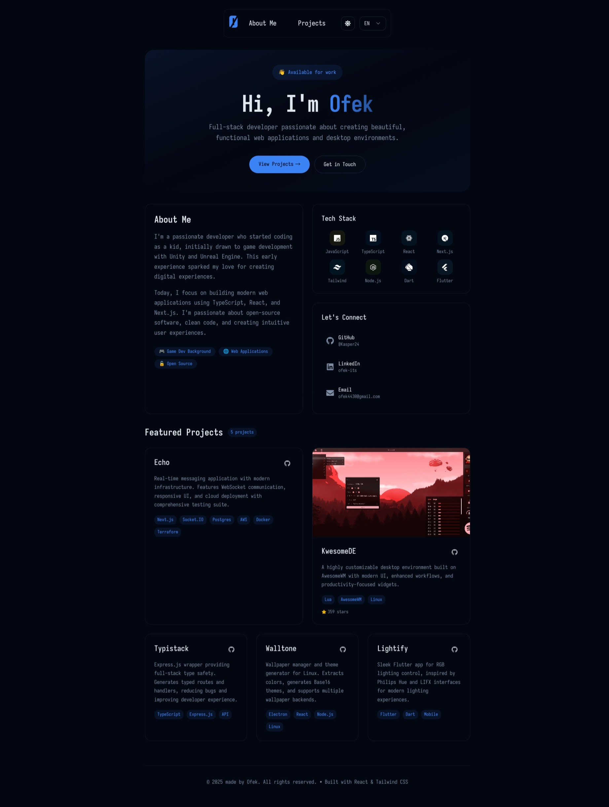

# Portfolio

A modern, responsive personal portfolio website built with React, TypeScript, and Tailwind CSS.

## 🚀 Features

- **Modern Design**: Clean, minimalist interface with smooth animations
- **Responsive**: Optimized for desktop, tablet, and mobile devices
- **Dark/Light Mode**: Theme switching with system preference detection
- **Type-Safe**: Built with TypeScript for better development experience
- **Accessible**: WCAG compliant with comprehensive accessibility testing
- **Fast**: Optimized performance with Vite and modern build tools

## 🛠️ Tech Stack

- **Frontend**: React 18, TypeScript
- **Styling**: Tailwind CSS, Radix UI components
- **Build Tool**: Vite
- **Testing**: Vitest (unit), Playwright (e2e), Testing Library
- **Deployment**: GitHub Pages
- **Code Quality**: ESLint, Prettier, TypeScript strict mode

## 📱 Responsive Design

The portfolio adapts seamlessly across all screen sizes:
- **Desktop**: Full navigation with hover effects
- **Mobile**: Collapsible hamburger menu with touch-friendly interactions
- **Tablet**: Optimized layouts for medium screen sizes

## 🎨 Theme System

- System preference detection
- Manual theme toggle
- Persistent theme storage
- Smooth transitions between themes

## 🧪 Testing

Comprehensive testing strategy:
- **Unit Tests**: Component testing with Vitest and Testing Library
- **E2E Tests**: User journey testing
